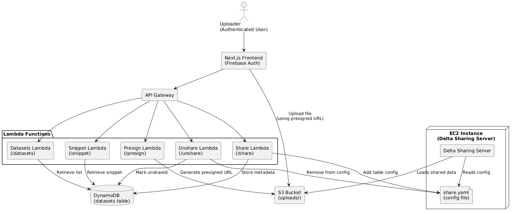
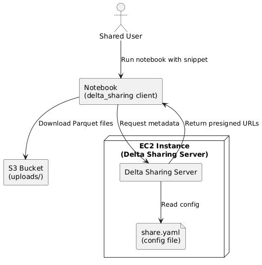
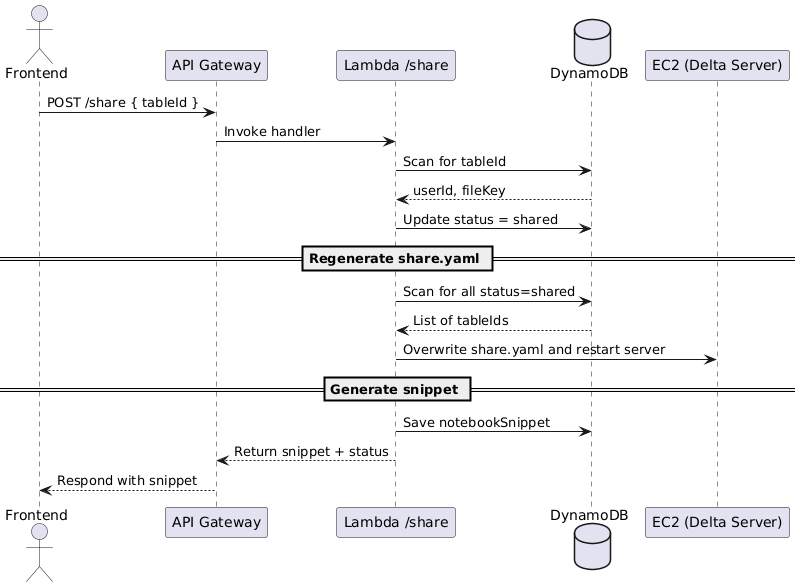

# Delta-Bridge

An AWS-based data-sharing service built on [Delta Sharing](https://github.com/delta-io/delta-sharing).  
Users can upload CSVs via a frontend, convert them into Delta tables, share them through a live Delta Sharing server, and consume them in notebooks with a simple snippet.

---

## Table of Contents

- [Architecture Overview](#architecture-overview)
- [Uploader Flow](#uploader-flow)
- [Shared User Flow](#shared-user-flow)
- [Sequence Diagram: `/share`](#sequence-diagram-share)
- [Getting Started](#getting-started)
  - [Prerequisites](#prerequisites)
  - [Deployment](#deployment)

---

## Architecture Overview

Delta-Bridge consists of:

- **Next.js frontend** (with Firebase Auth)
- **API Gateway** routing to Lambda handlers
- **Lambda functions** for `/presign`, `/process`, `/share`, `/unshare`, `/datasets`, `/snippet`
- **S3 bucket** for raw CSVs and generated Delta tables
- **DynamoDB** table tracking dataset metadata and notebook snippets
- **EC2 instance** running the Delta Sharing Server, serving live Delta tables via **share.yaml**

---

## Uploader Flow

Illustrates how an authenticated user uploads and shares a dataset:



1. **Frontend** requests a presigned URL (`POST /presign`)
2. **Frontend** uploads CSV directly to **S3**
3. **Frontend** calls `/share` with the `tableId`
4. **Lambda** updates DynamoDB status → “shared”
5. **Lambda** regenerates `share.yaml` on EC2 and restarts the Delta server
6. **Lambda** returns notebook snippet & status
7. `/datasets`, `/snippet`, and `/unshare` routes let the uploader list, view, or revoke shares

---

## Shared User Flow

Shows how a consumer notebook uses the shared snippet:



1. **Shared User** pastes/runs the notebook snippet
2. **delta_sharing** client requests metadata from the **Delta Sharing Server**
3. Server reads **share.yaml**, returns presigned Parquet file URLs
4. Notebook downloads Parquet files directly from **S3**
5. Data is loaded into a Pandas DataFrame for analysis

---

## Sequence Diagram: `/share`

Detailed sequence for the `/share` API call:



1. **Frontend** → API Gateway → `Lambda (/share)`
2. Lambda scans and updates DynamoDB
3. Lambda rescans all “shared” records, pushes new `share.yaml` to EC2 & restarts server
4. Lambda saves the generated notebook snippet
5. Response returns snippet and share status

---

## Getting Started

### Prerequisites

- **AWS account** with IAM permissions for S3, DynamoDB, Lambda, SSM, EC2
- **Node.js** (v16+) & Yarn/npm
- **Pulumi** (or Terraform) CLI configured for your AWS profile
- **Python 3.9+** (for local tests & Delta Sharing client)

### Deployment

1. Clone the repo:
   ```bash
   git clone git@github.com:wnkinc/delta-bridge.git
   cd delta-bridge
   ```
